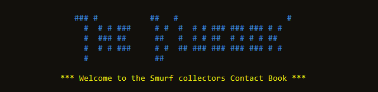
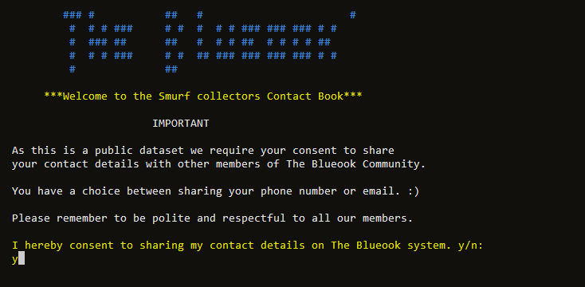
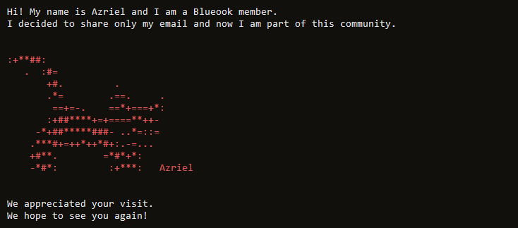
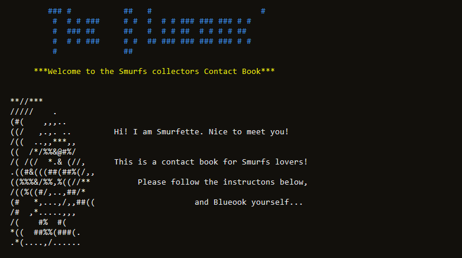
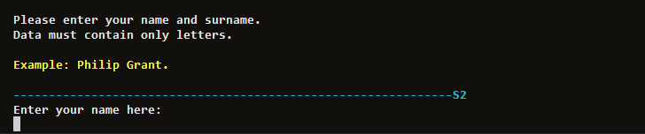
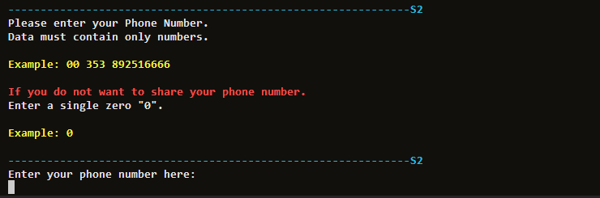
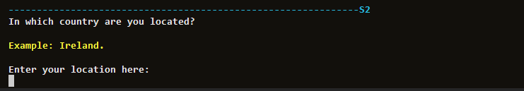
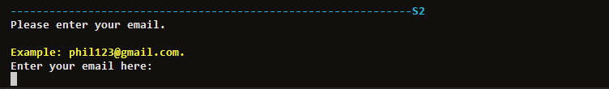
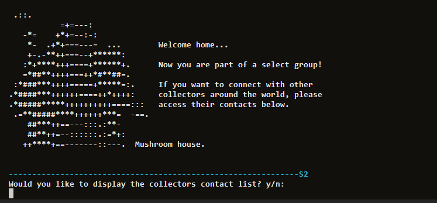
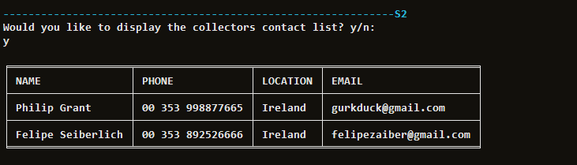

# The Blueook
**Welcome to The Blueook system!**

This system grants user input and displays recommendations on what should be done to be connected with a large and worldwide community of Smurf's lovers.
It is a modest system, but provide the users a contact list of other collectors who share the same passion - Smurfs!

[The Blueook](https://contact-blueook-b9e733172da3.herokuapp.com/)

## User Story

We find passionate collectors of these little blue creatures all around the world. The Smurfs were 
created in 1958 by Belgian cartoonist Pierre Culliford, better known by his pen name "Peyo” who was born in Brussels on 25th June 1928. The original Smurf comics were published in French and later translated into Dutch, English, German, and Spanish.
 
Every year international fairs take place in Belgium and other countries and this is a great opportunity for collectors to get to know each other.
That's where The Blueook system was first envisioned. A simple way to build a network of collectors to share information on their collections.

As someone's personal details are considered sensitive data, the program starts with an important message asking permission for the user to share their details with other members.

* If the user do not consent sharing their contact the program exit.

 
At this first stage of the project the system provide an input data to store the collector's contact into a spreadsheet. In the beginning of the program the user is greeted by one of the Smurf characters called Smurfette. She explains the usability of the program and advises the user to follow the instructions that follow.

## Summary

The Blueook system would like to be able to:
1. Input users name.
1. Input users phone number.
1. Input users location.
1. Input users email.
1. Check if data inputted is valid.
1. Upload data inputted into a Google sheet.
1. Have access to the data inputted on the Google sheet.

## Features
**Input name**

The user is requested to input their name and surname using only letters.
If any other characters are used an error message will be displayed and a new request will be made until only valid characters are inserted.

**Input phone number**

The User is requested to input phone numbers using only numbers.
If any other characters are used an error message will be displayed and a new request will be made until only valid characters are inserted.

**Input location**

The user is requested to input in which country they reside.

**Input email**

The user is requested to input their email contact.

**Confirming user input is correct**

Input name and phone number are both confirmed by the program if they are following the rules stipulated.

**Data validation**

The inputed data is validated and inserted into a list to be transfered to the worksheet.

**Display Contact List or exit**

## The Blueook Google Worksheet View

## Future Features

1. Confirming if user location and email inputs are correct.
1. Link the program to a website.

## Testing

To ensure there were no bugs in the interface and that the system could handle incorrect user input. Many tests were conducted to cover all bases.

## Validator testing

Passed data through Online IDE and no major errors were found.

Heroku works correctly as planned across Google Chrome, Safari, Microsoft Edge and Mozilla Firefox.

For user experience purposes, it's best to run the program on a tablet, laptop or desktop, as on mobile it may be too small to read the instructions and recommendations.

## Bugs and Solutions

First bug found was when the invalid data was being transfered into the spreadsheet. Bug was fixed returning the right data only into the spreadsheet.

Second bug was related to the table measurents that was overllaping into each other. The dimensions were fixed and table fit into the program width.

There are no remaining bugs that I am aware of.

## Google API Setup
The value of using the Google API Sheets library is that it's built on HTTP and JSON, so any standard HTTP client can send requests to it and parse the responses. In other words, our project can feed data to the Google Sheet using an API and we can see the result of that data in a format suitable for Google Sheets. It's also not just used for Python, the Google API client libraies provide better language integration, improved security and support for making calls that require user authorisation. The client libraries are available in a number of programming languages. To get set up with a Google Sheet's API, you will need to select which language your project is for and then following the installation steps online.

The reason for using Google Sheets for this project is so that the NDoS and other permitted users could view past and current data inputted and be able to make insightful, data-driven decisions on what actions they should take for each salon. Using Google Sheets, meant that we could leverage formulas and highlight cells that were not equal to or greater than the city's target ABV. This added ability allows for instant clarity on what city is performing well or not, which the python program alone is not the best way to display such data. Using Google Sheets also allows the NDoS to share the file to the Regional Managers, in a read-only format, so they can understand how their salon is performing against other salons.

Link to The Blueook Google worksheet [here](https://docs.google.com/spreadsheets/d/1_iazxzHMnARZp3ow2q3PlCwY0wfxIekU50Y1wxL0H9Y/edit#gid=0)

 
Setting Up the Google API

  1. Create a Google account.
  2. Create a Google Sheet and name the file. Preferably matching your GitHub repository name.
  3. Then visit [Google Cloud Platform](https://console.cloud.google.com/)
  4. Make sure you select your personal Google account. This is to prevent other users from changing settings that could impact your final program.
  5. Next to the Google Cloud Platform burger menu, click "Select a project" and then select "New project".
  6. Then give your project a name. Preferably matching your GitHub repository and Google Sheets doc name. Then click "Create".
  7. Then click "Select project" again. But this time select the name of the project you just created.
  8. Now you're on your project dashboard, ensure the side menu/burger menu is open and select "API & Services" and then "Library".
  9. First search for "Google Drive" in the search bar. Click on the API at the top and click "Enable".
  10. Now you will need to create credentials to access the Google Sheets. Click "Create credentials".
  11. In the form, under "Which API are you using?", please select "Google Drive API".
  12. For "What data will you be accessing?", please select "Application Data".
  13. For the "Are you planning to use this API with Compute Engine, Kubernetes Engine, App Engine, or Cloud Functions?" question, please select "No, I'm not using them".
  14. Click "Next", then "Done".
  15. Now enter a Service account name. Preferably matching your Google Cloud project name if available.
  16. Then go to "Grant this service account access to project".
  17. In the Role dropdown box, select "Basic", then "Editor".
  18. Press "Continue".
  19. "Grant users access to this service `account`" can be left blank.
  20. Click "Done".
  21. On the next page, click on the service account that has just been created.
  22. Now click on the "Keys" tab.
  23. Click the "Add Key" dropdown button and select "Create New Key".
  24. Select "JSON" and then click "Create". This will trigger the .json file with your API credentials in it to download to your machine.
  25. Now, click on the main burger menu, select "API & Services" and select "Library".
  26. In the search bar, enter "Google Sheets" and select the "Google Sheets API" option and click "Enable".

 
Link your Google API Credentials to Gitpod Workspace

 
  1. Drag and drop the .json file from your downloads folder into your Gitpod workspace.
  2. Rename the file to "creds.json"
  3. Now open the creds.json file. Locate the "client_email" line and copy the email address next to it, without the quotes.
  4. Then navigate to your Google Sheets file and open the "Share" button.
  5. Paste in the client email address and make sure "Editor" is selected, untick "Notify People" and then click "Share".

 

Given that your `creds.json` file contains sensitive information. Make sure to add this file to your gitignore file, to prevent this data being committed or sent to GitHub.

To check that your `creds.json` file won't be committed, follow the below steps:

  1. In your terminal type `git add .` and press enter.
  2. Now type in `git status` and press enter.
  3. If the `creds.json` file is not listed in the staging area, you are safe to commit your changes.

## Technologies Used

- HTML5
- CSS3
- JavaScript
- Python3

## Credits

* I would like to thank my Code Institute mentor, Rahul for his support throughout the development of this project.

* I would like to thank the Code Institute Slack community for the moral support; it kept me going during periods of self doubt.

* Special mention: James Billcliffe.

* I would like to thank the student care agent (Kim), for all the support and for helping me when I needed the most.
	• I would like to thank LeanneCodes for inspire me in writting this README document.
